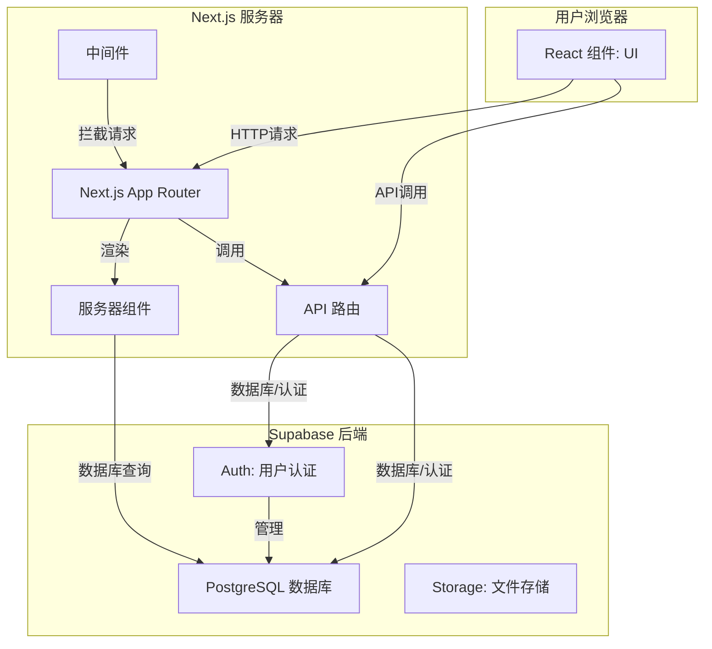
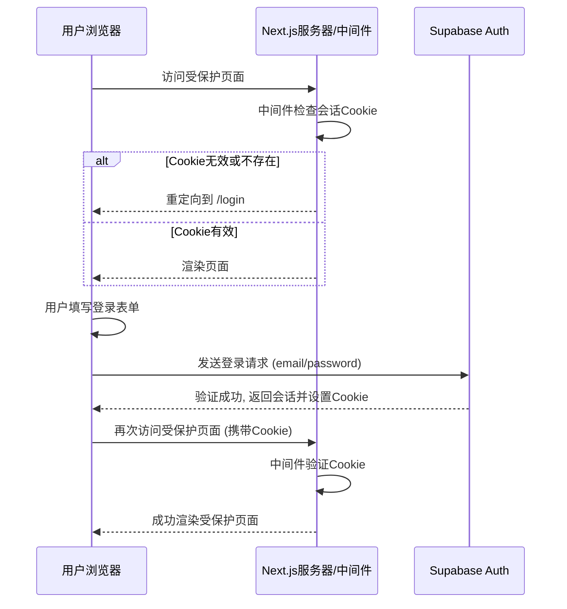
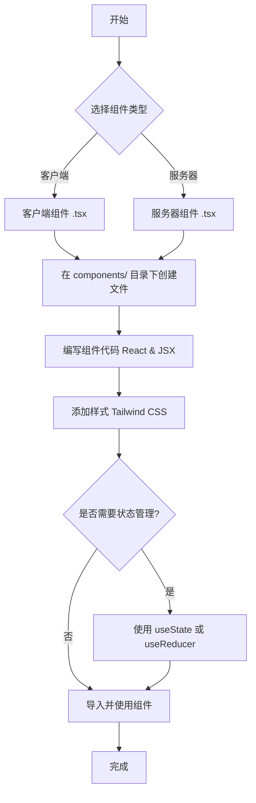
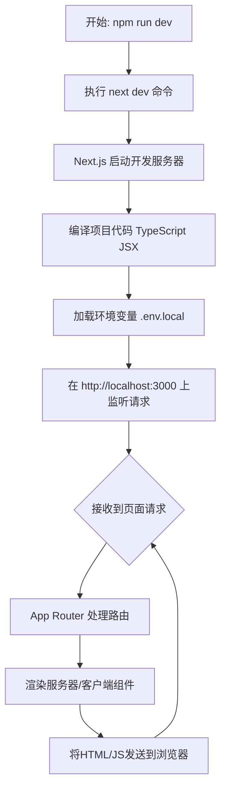

# 项目维基文档

欢迎来到项目维基！本文档旨在为新加入的开发者，特别是 React 初学者，提供一个全面的项目指南。

## 1. 项目概述

本项目是一个基于 Next.js 15 和 Supabase 构建的全栈 Web 应用。它演示了现代 Web 开发中的常见功能，包括用户认证、受保护的路由、数据管理以及响应式设计。

**主要功能:**

*   **用户认证**: 支持用户注册、登录、密码重置等功能。
*   **基于角色的访问控制**: 通过中间件保护特定路由，只允许已认证用户访问。
*   **合同管理**: 一个简单的 CRUD (创建、读取、更新、删除) 示例，用于管理合同。
*   **主题切换**: 支持浅色和深色模式。
*   **响应式设计**: 适应不同尺寸的屏幕。

## 2. 本地开发设置

为了在您的本地计算机上运行此项目，请按照以下步骤操作。

### 先决条件

*   [Node.js](https://nodejs.org/) (建议使用 v18 或更高版本)
*   [npm](https://www.npmjs.com/) (通常随 Node.js 一起安装)
*   一个 [Supabase](https://supabase.com/) 账户 (您可以免费注册一个)

### 安装步骤

1.  **克隆仓库**
    ```bash
    git clone <your-repository-url>
    cd with-supabase-app
    ```

2.  **安装依赖**
    使用 `npm` 安装项目所需的所有依赖项。
    ```bash
    npm install
    ```

3.  **配置环境变量**
    这是连接到 Supabase 后端的关键步骤。
    a. 在项目的根目录中，将 `.env.example` 文件复制并重命名为 `.env.local`。
    ```bash
    cp .env.example .env.local
    ```
    b. 登录到您的 [Supabase 仪表板](https://app.supabase.com)。
    c. 创建一个新项目（如果还没有的话）。
    d. 导航到您项目的 **Settings** > **API**。
    e. 在那里您会找到 **Project URL** 和 **Project API Keys** 下的 `anon` `public` key。
    f. 打开 `.env.local` 文件，并将 `your-project-url` 和 `your-anon-key` 替换为您在上一步中找到的实际值。

    ```dotenv
    # .env.local
    NEXT_PUBLIC_SUPABASE_URL=https://<your-project-ref>.supabase.co
    NEXT_PUBLIC_SUPABASE_PUBLISHABLE_OR_ANON_KEY=<your-anon-key>
    ```

4.  **设置数据库**
    为了使“合同管理”功能正常工作，您需要在 Supabase 数据库中创建一个 `contracts` 表。
    a. 在 Supabase 仪表板中，转到 **Table Editor**。
    b. 点击 **Create a new table**。
    c. 将表命名为 `contracts`。
    d. 添加以下列：
        *   `id` (uuid, primary key, default: `gen_random_uuid()`)
        *   `name` (text)
        *   `status` (text) - 您可以使用 'Active', 'Pending', 'Completed' 等值。
        *   `type` (text) - 例如 'Full-time', 'Part-time'。
        *   `amount` (int8)
        *   `startDate` (date)
        *   `endDate` (date)
        *   `created_at` (timestamptz, default: `now()`)

5.  **运行开发服务器**
    现在您可以启动 Next.js 开发服务器了。
    ```bash
    npm run dev
    ```
    应用将在 [http://localhost:3000](http://localhost:3000) 上运行。

## 3. 技术栈

*   **框架**: [Next.js 15](https://nextjs.org/) (使用 App Router)
*   **后端/数据库**: [Supabase](https://supabase.io/)
*   **UI**: [Tailwind CSS](https://tailwindcss.com/) & [shadcn/ui](https://ui.shadcn.com/)
*   **语言**: TypeScript
*   **代码检查**: ESLint

## 4. 项目结构

项目遵循 Next.js App Router 的标准结构。

```
/
├── app/                      # 应用路由
│   ├── auth/                 # 认证相关页面
│   ├── contracts/            # 合同管理页面
│   ├── protected/            # 受保护的页面
│   ├── layout.tsx            # 根布局
│   └── page.tsx              # 首页
├── components/               # 可复用组件
│   ├── auth-button.tsx       # 认证状态按钮
│   ├── login-form.tsx        # 登录表单
│   └── ...
├── lib/                      # 库和辅助函数
│   ├── supabase/             # Supabase 客户端和中间件
│   │   ├── client.ts
│   │   ├── server.ts
│   │   └── middleware.ts
├── middleware.ts             # Next.js 中间件
└── ...
```

## 5. 认证机制深度解析

认证是项目的核心，由 Supabase 提供支持。理解其工作原理对于构建安全的应用至关重要。整个流程可以分为客户端交互、会话管理和服务器端验证三个部分。

### 客户端 vs. 服务器端 Supabase 客户端

项目中存在两种 Supabase 客户端，它们在不同的环境中工作：

*   **客户端 (`lib/supabase/client.ts`)**: 使用 `createBrowserClient` 创建。这个客户端运行在用户的浏览器中，用于处理实时用户交互，如登录和注册。它直接与 Supabase API 通信，并在成功认证后处理返回的会话信息（通常是设置 Cookie）。

*   **服务器端 (`lib/supabase/server.ts`)**: 使用 `createServerClient` 创建。这个客户端在服务器环境（如 Next.js 的服务器组件或路由处理程序）中运行。它不直接与用户交互，而是通过读取和写入 HTTP 请求中的 Cookie 来管理用户会话。这使得服务器能够在渲染页面之前就安全地验证用户身份。

### 完整的认证流程

1.  **用户注册/登录 (`SignUpForm.tsx` / `LoginForm.tsx`)**
    *   当用户在注册或登录表单中填写信息并点击提交时，表单组件（它们是“客户端组件”）会调用在 `lib/supabase/client.ts` 中创建的**客户端** Supabase 实例。
    *   该客户端将用户的凭据发送到 Supabase 服务器进行验证。
    *   如果验证成功，Supabase 会生成一个会话，并通过设置一个安全的、httpOnly 的 Cookie 将其返回给浏览器。

2.  **会话刷新 (`middleware.ts`)**
    *   用户登录后，对应用的每一个后续请求都会首先经过 Next.js 的中间件 (`middleware.ts`)。
    *   这个中间件的核心任务是调用 `updateSession` 函数。此函数使用**服务器端** Supabase 客户端来接收请求中的 Cookie，验证其有效性，并在必要时刷新它。这确保了用户的登录状态在整个浏览过程中保持活动和安全。
    *   如果用户尝试访问受保护的路由（例如 `/protected`）但其 Cookie 无效或不存在，中间件会将他们重定向到登录页面。

3.  **服务器端验证 (`AuthButton.tsx` 和受保护页面)**
    *   像 `AuthButton.tsx` 这样的组件是“服务器组件”，它们在服务器上渲染。
    *   在渲染之前，它们会调用在 `lib/supabase/server.ts` 中创建的**服务器端** Supabase 客户端来检查当前请求中的有效会话 Cookie。
    *   基于是否存在有效的会话，组件可以动态地渲染不同的 UI——例如，显示“欢迎, user@example.com”和“登出”按钮，或者显示“登录”和“注册”按钮。
    *   这个模式同样适用于保护整个页面，使其仅对已认证的用户可见。

## 6. 核心组件详解

### `AuthButton.tsx`

这是一个**服务器组件**，负责在页面顶部显示用户的认证状态。

*   **工作原理**: 它在服务器上执行，使用 `lib/supabase/server.ts` 中的 `createClient` 来检查与当前请求关联的 Cookie。通过检查会话，它能确定是显示用户信息和登出按钮，还是显示登录/注册链接。
*   **关键代码**: `const { data: { user } } = await supabase.auth.getUser();`

### `LoginForm.tsx` & `SignUpForm.tsx`

这两个是**客户端组件**，为用户提供了与认证系统交互的界面。

*   **工作原理**: 它们使用 `useState` 来管理表单输入（如电子邮件和密码）。当用户提交表单时，它们会调用 `lib/supabase/client.ts` 中的 `createClient` 来执行 `signInWithPassword` 或 `signUp` 操作。它们还处理加载状态和向用户显示错误消息。
*   **关键代码**: `const { error } = await supabase.auth.signInWithPassword({ email, password });`

## 7. 合同管理功能

`app/contracts` 目录包含了合同管理功能的实现。目前，数据是硬编码在 `lib/mock-data.ts` 中的。在真实的应用程序中，您将从 Supabase 数据库中获取这些数据。

## 8. 系统图表

为了更直观地理解项目，以下是一些关键流程的图表。

### 项目架构图



### 认证数据流图



### 组件开发流程图



### 系统启动流程图



## 9. 初学者技术指导

### 9.1 React 基础概念详解

作为一个 React 初学者，理解以下核心概念对于掌握这个项目至关重要：

#### 什么是组件 (Components)？

组件是 React 应用的基本构建块。可以把组件想象成乐高积木 - 每个积木都有特定的功能，你可以将它们组合起来构建复杂的结构。

**函数组件示例：**
```tsx
// 这是一个简单的函数组件
function Welcome(props) {
  return <h1>Hello, {props.name}!</h1>;
}

// 使用组件
<Welcome name="张三" />
```

**在我们项目中的实际例子：**
```tsx
// components/auth-button.tsx 是一个服务器组件
export default async function AuthButton() {
  const supabase = createClient();
  const { data: { user } } = await supabase.auth.getUser();

  return user ? (
    <div className="flex items-center gap-4">
      Hey, {user.email}!
      <LogoutButton />
    </div>
  ) : (
    <Link href="/auth/login">
      登录
    </Link>
  );
}
```

#### 状态 (State) 是什么？

状态是组件的"记忆"。它存储了组件需要记住的信息，比如用户输入、是否显示某个元素等。

**状态示例：**
```tsx
import { useState } from 'react';

function Counter() {
  // 声明一个状态变量 count，初始值为 0
  const [count, setCount] = useState(0);

  return (
    <div>
      <p>你点击了 {count} 次</p>
      <button onClick={() => setCount(count + 1)}>
        点击我
      </button>
    </div>
  );
}
```

**在我们项目中的实际例子：**
```tsx
// components/login-form.tsx 中的状态使用
export default function LoginForm() {
  const [email, setEmail] = useState('');
  const [password, setPassword] = useState('');
  const [isLoading, setIsLoading] = useState(false);

  const handleSubmit = async (e: FormEvent) => {
    e.preventDefault();
    setIsLoading(true); // 设置加载状态
    
    const { error } = await supabase.auth.signInWithPassword({
      email,
      password,
    });
    
    setIsLoading(false); // 取消加载状态
  };

  return (
    <form onSubmit={handleSubmit}>
      <input 
        value={email} 
        onChange={(e) => setEmail(e.target.value)} 
        placeholder="邮箱"
      />
      <input 
        value={password} 
        onChange={(e) => setPassword(e.target.value)} 
        placeholder="密码"
        type="password"
      />
      <button disabled={isLoading}>
        {isLoading ? '登录中...' : '登录'}
      </button>
    </form>
  );
}
```

#### Props（属性）

Props 是组件之间传递数据的方式。就像函数的参数一样。

```tsx
// 父组件传递数据给子组件
function App() {
  return <UserCard name="李四" age={25} />;
}

// 子组件接收并使用数据
function UserCard({ name, age }) {
  return (
    <div>
      <h2>{name}</h2>
      <p>年龄: {age}</p>
    </div>
  );
}
```

### 9.2 Next.js 深度解析

#### App Router vs Pages Router

Next.js 13+ 引入了新的 App Router，这是我们项目使用的路由系统。

**文件系统路由：**
```
app/
├── page.tsx          → / (首页)
├── about/
│   └── page.tsx      → /about
├── auth/
│   ├── login/
│   │   └── page.tsx  → /auth/login
│   └── sign-up/
│       └── page.tsx  → /auth/sign-up
└── protected/
    └── page.tsx      → /protected
```

#### 服务器组件 vs 客户端组件

这是 Next.js 13+ 的重要概念：

**服务器组件（默认）：**
- 在服务器上运行
- 可以直接访问数据库
- 不能使用浏览器 API（如 `useState`, `useEffect`）
- 更好的性能和 SEO

```tsx
// app/page.tsx - 服务器组件
import { createClient } from '@/lib/supabase/server';

export default async function HomePage() {
  const supabase = createClient();
  const { data: user } = await supabase.auth.getUser();
  
  return (
    <div>
      <h1>欢迎来到首页</h1>
      {user && <p>你好, {user.email}!</p>}
    </div>
  );
}
```

**客户端组件（需要 'use client' 指令）：**
- 在浏览器中运行
- 可以使用 React hooks
- 可以处理用户交互

```tsx
// components/login-form.tsx - 客户端组件
'use client';

import { useState } from 'react';

export default function LoginForm() {
  const [email, setEmail] = useState('');
  // ... 其他逻辑
}
```

### 9.3 TypeScript 基础指导

TypeScript 为 JavaScript 添加了类型系统，帮助我们在开发时发现错误。

#### 基本类型

```tsx
// 基本类型声明
let name: string = "张三";
let age: number = 25;
let isStudent: boolean = true;
let hobbies: string[] = ["读书", "游泳"];

// 对象类型
interface User {
  id: string;
  email: string;
  name?: string; // ? 表示可选属性
}

const user: User = {
  id: "123",
  email: "user@example.com"
};
```

#### 在项目中的实际使用

```tsx
// lib/supabase/client.ts 中的类型使用
import { createBrowserClient } from '@supabase/ssr';

export function createClient() {
  return createBrowserClient<Database>( // Database 是类型参数
    process.env.NEXT_PUBLIC_SUPABASE_URL!,
    process.env.NEXT_PUBLIC_SUPABASE_PUBLISHABLE_OR_ANON_KEY!
  );
}

// 组件中的类型使用
interface LoginFormProps {
  onSuccess?: () => void;
  redirectTo?: string;
}

export default function LoginForm({ onSuccess, redirectTo }: LoginFormProps) {
  // 组件逻辑
}
```

### 9.4 Tailwind CSS 使用指南

Tailwind CSS 是一个实用优先的 CSS 框架。

#### 常用类名解释

```tsx
<div className="flex items-center justify-between p-4 bg-white rounded-lg shadow-md">
  {/* 
    flex: 设置为弹性布局
    items-center: 垂直居中对齐
    justify-between: 水平两端对齐
    p-4: 内边距 1rem (16px)
    bg-white: 白色背景
    rounded-lg: 大圆角
    shadow-md: 中等阴影
  */}
</div>
```

#### 响应式设计

```tsx
<div className="w-full md:w-1/2 lg:w-1/3">
  {/* 
    w-full: 默认全宽
    md:w-1/2: 中等屏幕及以上时宽度为 50%
    lg:w-1/3: 大屏幕及以上时宽度为 33.33%
  */}
</div>
```

#### 在项目中的实际例子

```tsx
// components/login-form.tsx 中的样式
<form className="flex flex-col gap-4 p-6 bg-white rounded-lg shadow-lg">
  <input 
    className="px-4 py-2 border border-gray-300 rounded-md focus:outline-none focus:ring-2 focus:ring-blue-500"
    type="email"
    placeholder="邮箱地址"
  />
  <button 
    className="px-4 py-2 bg-blue-500 text-white rounded-md hover:bg-blue-600 disabled:opacity-50"
    disabled={isLoading}
  >
    登录
  </button>
</form>
```

## 10. 代码示例和逐行解释

### 10.1 完整的登录流程解析

让我们深入分析用户登录的完整流程：

```tsx
// components/login-form.tsx
'use client'; // 1. 声明这是客户端组件

import { useState, FormEvent } from 'react'; // 2. 导入 React hooks
import { createClient } from '@/lib/supabase/client'; // 3. 导入 Supabase 客户端
import { useRouter } from 'next/navigation'; // 4. 导入路由钩子

export default function LoginForm() {
  // 5. 声明状态变量
  const [email, setEmail] = useState(''); // 存储邮箱输入
  const [password, setPassword] = useState(''); // 存储密码输入
  const [isLoading, setIsLoading] = useState(false); // 存储加载状态
  const [error, setError] = useState<string | null>(null); // 存储错误信息
  
  const router = useRouter(); // 6. 获取路由实例
  const supabase = createClient(); // 7. 创建 Supabase 客户端

  // 8. 处理表单提交的函数
  const handleSubmit = async (e: FormEvent<HTMLFormElement>) => {
    e.preventDefault(); // 9. 阻止表单默认提交行为
    setIsLoading(true); // 10. 设置加载状态
    setError(null); // 11. 清除之前的错误

    try {
      // 12. 调用 Supabase 登录 API
      const { error } = await supabase.auth.signInWithPassword({
        email,
        password,
      });

      if (error) {
        // 13. 如果有错误，显示错误信息
        setError(error.message);
      } else {
        // 14. 登录成功，重定向到受保护页面
        router.push('/protected');
        router.refresh(); // 刷新页面以更新认证状态
      }
    } catch (err) {
      // 15. 处理意外错误
      setError('登录时发生意外错误');
    } finally {
      // 16. 无论成功还是失败，都取消加载状态
      setIsLoading(false);
    }
  };

  return (
    <form onSubmit={handleSubmit} className="space-y-4">
      {/* 17. 错误信息显示 */}
      {error && (
        <div className="p-3 text-red-700 bg-red-100 rounded-md">
          {error}
        </div>
      )}
      
      {/* 18. 邮箱输入框 */}
      <div>
        <label htmlFor="email" className="block text-sm font-medium">
          邮箱地址
        </label>
        <input
          id="email"
          type="email"
          value={email}
          onChange={(e) => setEmail(e.target.value)} // 19. 更新邮箱状态
          required
          className="mt-1 block w-full px-3 py-2 border border-gray-300 rounded-md"
        />
      </div>

      {/* 20. 密码输入框 */}
      <div>
        <label htmlFor="password" className="block text-sm font-medium">
          密码
        </label>
        <input
          id="password"
          type="password"
          value={password}
          onChange={(e) => setPassword(e.target.value)} // 21. 更新密码状态
          required
          className="mt-1 block w-full px-3 py-2 border border-gray-300 rounded-md"
        />
      </div>

      {/* 22. 提交按钮 */}
      <button
        type="submit"
        disabled={isLoading} // 23. 加载时禁用按钮
        className="w-full py-2 px-4 bg-blue-600 text-white rounded-md hover:bg-blue-700 disabled:opacity-50"
      >
        {isLoading ? '登录中...' : '登录'} {/* 24. 根据状态显示不同文本 */}
      </button>
    </form>
  );
}
```

### 10.2 中间件工作原理解析

```tsx
// middleware.ts
import { type NextRequest } from 'next/server';
import { updateSession } from '@/lib/supabase/middleware';

export async function middleware(request: NextRequest) {
  // 1. 对每个请求调用 updateSession
  return await updateSession(request);
}

export const config = {
  // 2. 配置中间件匹配的路径
  matcher: [
    '/((?!_next/static|_next/image|favicon.ico|.*\\.(?:svg|png|jpg|jpeg|gif|webp)$).*)',
  ],
};
```

```tsx
// lib/supabase/middleware.ts
import { createServerClient } from '@supabase/ssr';
import { NextResponse, type NextRequest } from 'next/server';

export async function updateSession(request: NextRequest) {
  let response = NextResponse.next({
    request: {
      headers: request.headers,
    },
  });

  // 1. 创建服务器端 Supabase 客户端
  const supabase = createServerClient(
    process.env.NEXT_PUBLIC_SUPABASE_URL!,
    process.env.NEXT_PUBLIC_SUPABASE_PUBLISHABLE_OR_ANON_KEY!,
    {
      cookies: {
        // 2. 配置 cookie 处理
        get(name: string) {
          return request.cookies.get(name)?.value;
        },
        set(name: string, value: string, options: any) {
          request.cookies.set({ name, value, ...options });
          response = NextResponse.next({
            request: { headers: request.headers },
          });
          response.cookies.set({ name, value, ...options });
        },
        remove(name: string, options: any) {
          request.cookies.set({ name, value: '', ...options });
          response = NextResponse.next({
            request: { headers: request.headers },
          });
          response.cookies.set({ name, value: '', ...options });
        },
      },
    }
  );

  // 3. 获取当前用户信息
  const { data: { user } } = await supabase.auth.getUser();

  // 4. 如果用户未登录且访问受保护路由，重定向到登录页
  if (!user && request.nextUrl.pathname.startsWith('/protected')) {
    return NextResponse.redirect(new URL('/auth/login', request.url));
  }

  // 5. 如果用户已登录且访问登录页，重定向到受保护页面
  if (user && request.nextUrl.pathname === '/auth/login') {
    return NextResponse.redirect(new URL('/protected', request.url));
  }

  return response;
}
```

## 11. 常见问题解答 (FAQ)

### Q1: 为什么我的组件没有显示？
**A:** 检查以下几点：
1. 确保组件正确导出：`export default function MyComponent()`
2. 确保正确导入：`import MyComponent from './MyComponent'`
3. 检查组件是否有返回值
4. 查看浏览器控制台是否有错误信息

### Q2: 状态更新后组件没有重新渲染？
**A:** 常见原因：
1. 直接修改状态而不是使用 setter：
   ```tsx
   // ❌ 错误
   state.push(newItem);
   
   // ✅ 正确
   setState([...state, newItem]);
   ```
2. 状态是对象时没有创建新对象：
   ```tsx
   // ❌ 错误
   user.name = 'new name';
   setUser(user);
   
   // ✅ 正确
   setUser({ ...user, name: 'new name' });
   ```

### Q3: 环境变量不生效？
**A:** 检查：
1. 文件名是否正确：`.env.local`
2. 变量名是否以 `NEXT_PUBLIC_` 开头（客户端使用）
3. 重启开发服务器：`npm run dev`
4. 确保没有多余的空格或引号

### Q4: Supabase 连接失败？
**A:** 排查步骤：
1. 检查环境变量是否正确设置
2. 确认 Supabase 项目是否正常运行
3. 检查网络连接
4. 查看浏览器网络面板的请求状态

### Q5: TypeScript 类型错误？
**A:** 常见解决方法：
1. 为变量添加类型注解：`const name: string = 'John'`
2. 使用类型断言：`const element = document.getElementById('id') as HTMLElement`
3. 定义接口：
   ```tsx
   interface User {
     id: string;
     name: string;
   }
   ```

## 12. 学习资源和进阶指导

### 12.1 推荐学习路径

**第一阶段：基础知识**
1. [React 官方教程](https://react.dev/learn) - 学习 React 基础
2. [Next.js 官方文档](https://nextjs.org/docs) - 了解 Next.js 特性
3. [TypeScript 手册](https://www.typescriptlang.org/docs/) - 掌握 TypeScript

**第二阶段：实践项目**
1. 完成本项目的所有功能
2. 尝试添加新功能（如用户资料页面）
3. 部署项目到 Vercel

**第三阶段：进阶概念**
1. 学习状态管理（Zustand, Redux）
2. 了解测试（Jest, React Testing Library）
3. 学习性能优化

### 12.2 有用的工具和扩展

**VS Code 扩展：**
- ES7+ React/Redux/React-Native snippets
- Tailwind CSS IntelliSense
- TypeScript Importer
- Prettier - Code formatter

**开发工具：**
- React Developer Tools (浏览器扩展)
- Supabase CLI
- Postman (API 测试)

### 12.3 社区资源

- [React 中文社区](https://react.docschina.org/)
- [Next.js 中文文档](https://nextjs.org/docs)
- [Supabase 官方文档](https://supabase.com/docs)
- [Stack Overflow](https://stackoverflow.com/) - 问题解答

## 13. 项目扩展建议

### 13.1 功能扩展想法

1. **用户资料管理**
   - 添加用户头像上传
   - 个人信息编辑页面
   - 密码修改功能

2. **合同功能增强**
   - 合同文件上传
   - 合同状态流转
   - 合同搜索和筛选

3. **通知系统**
   - 实时通知
   - 邮件提醒
   - 系统消息

### 13.2 技术改进

1. **性能优化**
   - 图片懒加载
   - 代码分割
   - 缓存策略

2. **用户体验**
   - 加载动画
   - 错误边界
   - 离线支持

3. **安全性**
   - 输入验证
   - CSRF 保护
   - 权限控制

---

希望这份详细的技术指导能帮助您深入理解项目并快速成长为一名优秀的 React 开发者！记住，编程是一个实践的过程，多动手、多思考、多提问。祝您学习愉快！